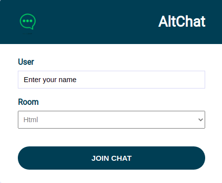
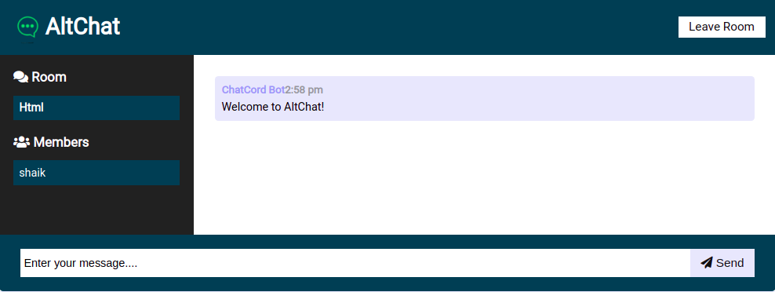

# hackathon-chat-app

<!--
*** Thanks for checking out the Best-README-Template. If you have a suggestion
*** that would make this better, please fork the repo and create a pull request
*** or simply open an issue with the tag "enhancement".
*** Thanks again! Now go create something AMAZING! :D
-->


<!-- PROJECT SHIELDS -->
<!--
*** I'm using markdown "reference style" links for readability.
*** Reference links are enclosed in brackets [ ] instead of parentheses ( ).
*** See the bottom of this document for the declaration of the reference variables
*** for contributors-url, forks-url, etc. This is an optional, concise syntax you may use.
*** https://www.markdownguide.org/basic-syntax/#reference-style-links
-->


<!-- PROJECT LOGO -->
<br />
<p align="center">
  <a href="https://github.com/othneildrew/Best-README-Template">
    
  </a>

  <h3 align="center">Alt Chat</h3>

  <p align="center">
   This is a messaging app
    <br />
    <a href="https://github.com/sohailshaik8328/hackathon-chat-app"><strong>Explore the docs »</strong></a>
    <br />
    <br />
    <a href="https://github.com/sohailshaik8328/hackathon-chat-app/issues">Issues</a>
    ·
    <a href="https://github.com/sohailshaik8328/hackathon-chat-app/pulls">Pull Requests</a>
    .
      <a href="https://github.com/sohailshaik8328/hackathon-chat-app/commits">Commits</a>
    .
    </p>
</p>


<!-- TABLE OF CONTENTS -->
<details open="open">
  <summary>Table of Contents</summary>
  <ol>
    <li>
      <a href="#about-the-project">About The Project</a>
      <ul>
        <li><a href="#built-with">Built With</a></li>
      </ul>
    </li>
    <li>
      <a href="#getting-started">Getting Started</a>
      <ul>
        <li><a href="#prerequisites">Prerequisites</a></li>
        <li><a href="#installation">Installation</a></li>
      </ul>
    </li>
    <li><a href="#usage">Usage</a></li>
    <li><a href="#roadmap">Roadmap</a></li>
    <li><a href="#contributing">Contributing</a></li>
    <li><a href="#license">License</a></li>
    <li><a href="#contact">Contact</a></li>
    <li><a href="#acknowledgements">Acknowledgements</a></li>
  </ol>
</details>


<!-- ABOUT THE PROJECT -->
## About The Project

The purpose of the chat application is to allow users be able to the chat with each other, like a normal chat application. The users will be able to chat with each other, most likely only from user to user, no group chatting will be developed, unless there is time to do so.

Here's why:
* Your time should be focused on creating something amazing. A project that solves a problem and helps others
* You shouldn't be doing the same tasks over and over like creating a PROJECT from scratch
* You should element DRY principles to the rest of your life :smile:

## Pages

### Home


### About Us 




A list of commonly used resources that I find helpful are listed in the acknowledgements.

### Built With

This section should list any major frameworks that you built your project using. Leave any add-ons/plugins for the acknowledgements section. Here are a few examples.
* [HTML](https://en.wikipedia.org/wiki/HTML)
* [CSS](https://en.wikipedia.org/wiki/CSS)
* [JavaScript](https://javascript.info/)
* [Node](https://nodejs.org/en/)
* [Express](https://en.wikipedia.org/wiki/Express.js)


<!-- GETTING STARTED -->
## Getting Started

**Let's Start**

### Prerequisites

This is for how to list things you need to use the software and how to install them.
* npm
  ```sh
  npm install -g
  ```

### Installation

1. Clone the repo
   ```sh
   git clone https://github.com/sohailshaik8328/hackathon-chat-app.git
   ```
2. Install NPM packages
   ```sh
   npm install
   ```
  
  


<!-- USAGE EXAMPLES -->
## Usage


 - Open the terminal and navigate to the project folder where the file is visible.
 - Execute `npm start` command.
 - Run the localhost:3000 in the browser.
 - Register by entering your name and select the room which you want to join.
 - Open another tab and run the localhost:3000 and join the application by entering your name and by selecting the same room which is selected by the above user.
 - Start messaging. 

_For more examples, please refer to the [Documentation](https://example.com)_


<!-- ROADMAP -->
## Roadmap

See the [open issues](https://github.com/sohailshaik8328/hackathon-chat-app/issues) for a list of proposed features (and known issues).


<!-- CONTRIBUTING -->
## Contributing

Contributions are what make the open source community such an amazing place to be learn, inspire, and create. Any contributions you make are **greatly appreciated**.


<!-- LICENSE -->
## License

Distributed under the MIT License. See `LICENSE` for more information.


<!-- CONTACT -->
## Contact

Sohail Shaik - 

- [Twitter](https://twitter.com/SohailS24733102)
- [Github](https://github.com/sohailshaik8328)

Abhishek Singh Rathore - 

- [Twitter](https://twitter.com/TheAbhi98765)
- [Github](https://github.com/abhishek-s-rathore)


Vasant Saraswat - 

- [Twitter](https://twitter.com/SaraswatVasant)
- [Github](https://github.com/Vasant11-97)


Zehan Khan - 
- [Twitter](https://twitter.com/zehan9211)
- [Github](https://github.com/zehan12)

Project Link: [https://github.com/your_username/repo_name](https://alt-campus-chat-app.herokuapp.com)


## Credit where credit's due

- Thank you othniel drew for the reference of the Read Me file. 


<!-- MARKDOWN LINKS & IMAGES -->
<!-- https://www.markdownguide.org/basic-syntax/#reference-style-links -->
[contributors-shield]: https://img.shields.io/github/contributors/othneildrew/Best-README-Template.svg?style=for-the-badge
[contributors-url]: https://github.com/othneildrew/Best-README-Template/graphs/contributors
[forks-shield]: https://img.shields.io/github/forks/othneildrew/Best-README-Template.svg?style=for-the-badge
[forks-url]: https://github.com/othneildrew/Best-README-Template/network/members
[stars-shield]: https://img.shields.io/github/stars/othneildrew/Best-README-Template.svg?style=for-the-badge
[stars-url]: https://github.com/othneildrew/Best-README-Template/stargazers
[issues-shield]: https://img.shields.io/github/issues/othneildrew/Best-README-Template.svg?style=for-the-badge
[issues-url]: https://github.com/othneildrew/Best-README-Template/issues
[license-shield]: https://img.shields.io/github/license/othneildrew/Best-README-Template.svg?style=for-the-badge
[license-url]: https://github.com/othneildrew/Best-README-Template/blob/master/LICENSE.txt
[linkedin-shield]: https://img.shields.io/badge/-LinkedIn-black.svg?style=for-the-badge&logo=linkedin&colorB=555
[linkedin-url]: https://linkedin.com/in/othneildrew
[product-screenshot]: images/template.png
[home-screenshot]: images/template.png
[about-screenshot]: images/about.png
[contact-screenshot]: images/contact.png
[input-screenshot]: images/input.png

